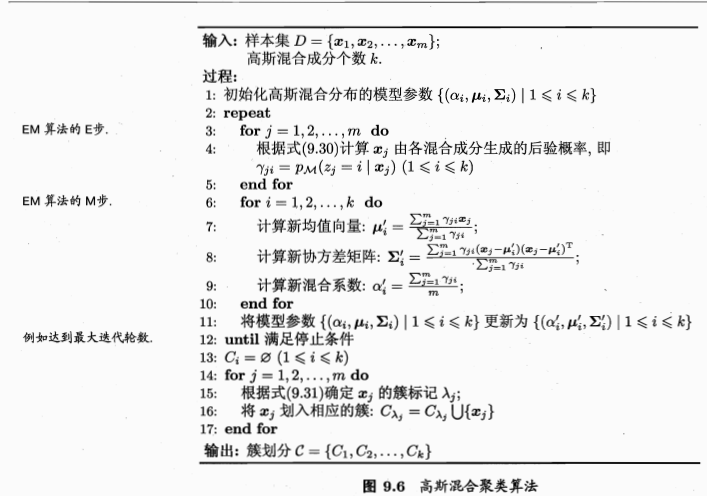

# 基于模型的聚类方法
## 高斯混合聚类
### 推导过程
* 对于n维样本空间X中的随机向量想，若x服从高斯分布，则其概率密度函数为
$p(x) = \frac{1}{(2\pi)^{\frac{n}{2}}|\Sigma|^{0.5}}e^{-\frac{1}{2}(x-\mu)^T\Sigma^{-1}(x-\mu)}$
我们将之记为 $p(x,\mu,\Sigma)$,其中$\mu$为均值向量，$\Sigma$为协方差矩阵
现在可以定义高斯混合分布为
$$
p_M(x) = \sum^k_{i=1}\alpha_i . p(x|\mu_i,\Sigma_i)
$$

其中$\mu_i$和$\Sigma_i$是第e个高斯混合成分的参数，$\alpha_i>0$为相应的混合系数，满足$\sum^k_{i=1}\alpha_i = 1$
* 若训练集$D= \{x_1,x_2,...,x_m\}$由上述过程生成，令随机变量$z_j\in\{1,2,...,k\}$表示生成样本$x_j$的高斯混合成分，显然，$z_j$的先验概率$p(z_j = i)$对应于$\alpha_i$(i=1,2,...,k),根据Bayes定理，$z_j$的后验分布对应于（记为$\gamma_{ji}$）
  $$
  p_M(z_j = i|x_j) = \frac{\alpha_i .p(x_j|\mu_i,\Sigma_i)}{\sum^k_{l=1}\alpha_l.p(x_j|\mu_l,\Sigma_l)}
  $$

* 分类的时候若把D分为k个簇，$C=\{C_1,C_2,...,C_k\}$，每个样本$x_j$的簇标记根据下式来确定
  $$
  \lambda_j = argmax_{i\in\{1,2,...,k\}}\gamma_{ji}
  $$
  而后对于样本集采用极大似然估计来求出$\mu_i$和$\Sigma_i$:
  $$
  LL(D) = ln(\Pi^m_{j=1}p_M(x_j)) = \sum^m_{j=1}ln(\sum^k_{i=1}\alpha_i.p(x_j|\mu_s,\Sigma_i))\\
  \mu_i = \frac{\sum^m_{i=1}\gamma_{ji}x_j}{\sum^m_{j=1}\gamma_{ji}}\\
  \Sigma_i = \frac{\sum^m_{j=1}\gamma_{ji}(x_j-\mu_i)(x_j-\mu_i)^T}{\sum^m_{j=1}\gamma_{ji}}
  $$

而对于混合系数$\alpha_i$来说,还需要考虑约束，需要用Lagrange乘子法：
$$
LL(D) +\lambda(\sum^k_{i=1}\alpha_i-1)\\
得到\alpha_i = \frac{1}{m}\sum^m_{j=1}\gamma_{ji}
$$
